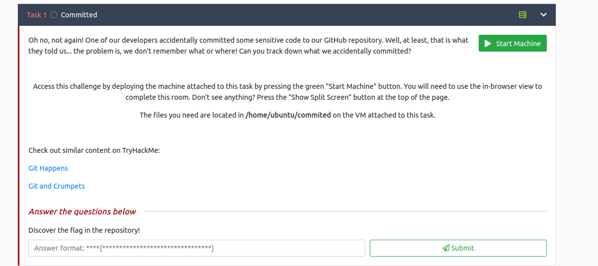

## Commited



As it said The files you need are located in /home/ubuntu/commited on the VM attached to this task.
So i started the machine and taken the zip in my local by starting python server, moving to commited directory.
```
python3 -m http.server
```
In my local machine downloaded using wget cmd
```
wget http://[IP]:[port]/commited.zip
```
Analysing with git log there is 5 commit done, and 2 file is normally visible at last commit.
1. main.py
2. README.md

Now i used the tool git extractor to extract all the commit with their files, you can download same from [here](https://raw.githubusercontent.com/internetwache/GitTools/master/Extractor/extractor.sh)

Run the tool
```
./gitextract.sh [git directory] [extract directory]
```
[](https://asciinema.org/a/RyfDy6Cuy5wv2DwKTKnZFW1ca)

Found 1 file Note, but seems there is no flag in that, flag found in main.py
